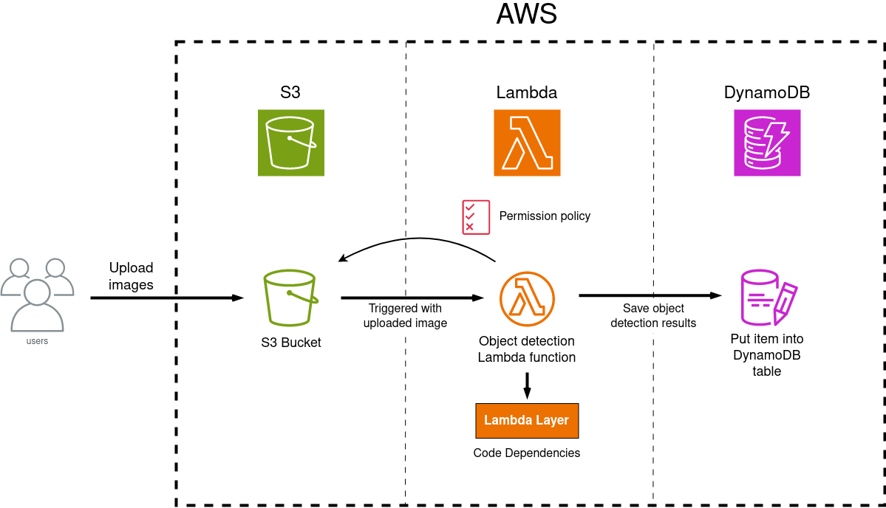

*Github Repository:* https://github.com/sueszli/wolke7

*About event driven architectures:* https://aws.amazon.com/event-driven-architecture/

# 1. Introduction

This report explores the performance and scalability differences between local and remote execution of data-intensive tasks using AWS cloud infrastructure. To achieve this, we developed an object detection application utilizing the YOLO (You Only Look Once) algorithm to identify objects in images. The application was tested in two environments: locally, through a web service, and remotely, using AWS Cloud services.

# 2. Problem Overview

Efficiently processing and computing object detection for large volumes of image data is resource-demanding, especially when using complex algorithms like YOLO. Local execution often suffers from limited processing power and scalability, resulting in slower inference times and potential bottlenecks. In contrast, AWS cloud infrastructure offers scalable and flexible resources that can handle data-intensive tasks more effectively, providing a more efficient and robust solution.

# 3. Methodology and Approach

In this chapter, we outline the methodology and approach used for developing an object detection application that utilizes the YOLO algorithm to identify objects in images. The methodology is divided into two main parts: local execution and AWS cloud-based execution. The steps for each part are detailed below.

## 3.1. Local Execution

This section outlines the methodology employed in developing the Flask server for local execution of an object detection application using the YOLO algorithm. The server was designed to handle image uploads, perform real-time object detection, and provide system information through a series of defined REST API endpoints.

The Flask server was developed using Python, leveraging various libraries for image processing, system monitoring, and web server functionality. Key libraries included OpenCV (`cv2`) for image manipulation and YOLO integration, `numpy` for numerical operations, `psutil` for system information retrieval, `GPUtil` for GPU monitoring (if available), and `requests` for HTTP communication with the server.

The core functionality of object detection was encapsulated in the `ObjectDetection` class. This class was responsible for initializing the YOLO model the corresponding config files. The `ObjectDetection` class provided a method detect_objects to process image data received from client requests: - Input Handling: Accepting base64 encoded image data. - Image Processing: Conversion of encoded image data to OpenCV format, preparation of image blob for YOLO, and execution of object detection using the YOLO network. - Output: Detection results including object labels, confidence scores, and optionally annotated images.

The client script iteratively processes images from the specified folder, encodes them accordingly, and uploades them to the Flask server for object detection. Additionally, we perform a calculation of total and average transfer times, inference times for each uploaded image, and retrieval of comprehensive system information using a defined API endpoint (`/api/system_info`).

## 3.2. AWS Cloud-based Execution

In this section, we provide a detailed description of the offloading solution's architecture and the AWS setup process. An architectural diagram is included to illustrate the overall system design and workflow.

To establish our AWS Cloud-based object detection service, we leverage the Boto3 API extensively for all operations, eliminating any manual use of the AWS Management Console for component creation.

The process begins with the creation of a DynamoDB table and an S3 bucket using Boto3. For integrating Lambda with the S3 bucket, we first develop the Lambda function code locally, ensuring it includes all necessary dependencies. Once the function is ready, we package these dependencies into a ZIP file and upload it to the previously created S3 bucket using Boto3. We also upload the YOLO config files. 

Next, we employ the Boto3 API to create a Lambda Layer that encapsulates these dependencies. This approach is chosen for two primary reasons: first, it separates the core function logic from its dependencies, promoting cleaner and more maintainable code; second, it allows these dependencies to be shared across multiple functions, facilitating potential future expansions of our service.

Finally, using Boto3, we establish a Lambda function that is linked to both the S3 bucket for event triggers and the Lambda Layer containing the dependencies. This setup ensures that our Lambda function is equipped with the necessary resources and dependencies to perform object detection seamlessly whenever new images are uploaded to the S3 bucket.

The Lambda function first checks if the necessary YOLO configuration files and the uploaded image are present locally in the temporary (`tmp`) folder. If these files are not already available locally, the Lambda function downloads them from the S3 bucket that triggered the function. Subsequently, the uploaded image is processed for object detection. The detected objects along with relevant metadata are then stored as an item in the DynamoDB table associated with the application.

# 4. Results

Local Execution results:

| Metric                   | Value                              |
|:-------------------------|:-----------------------------------|
| Total Images Processed   | 100                                |
| Total Transfer Time      | 25.3988 seconds                    |
| Average Transfer Time    | 0.2540 seconds                     |
| Average Inference Time   | 0.0939 seconds                     |
| CPU Usage                | 12.4%                              |
| Current CPU Frequency    | 1003.7976 MHz                      |
| Max CPU Frequency        | 3600.0 MHz                         |
| Min CPU Frequency        | 400.0 MHz                          |
| Physical Cores           | 4                                  |
| Total Cores              | 8                                  |

# 5. Conclusions

This report analyzed the performance and scalability differences between local and AWS cloud-based execution of data-intensive tasks using an object detection application based on the YOLO algorithm. Testing
with 100 images revealed that local deployment significantly outperforms cloud deployment, with a 2-3 times
performance boost due to lower latency and reduced data transfer overhead.
However, AWS cloud infrastructure offers superior scalability and flexibility, essential for handling larger
datasets and variable workloads. While local execution is advantageous for smaller datasets with immediate
processing needs, cloud deployment is ideal for extensive and dynamic tasks requiring scalable resources.
