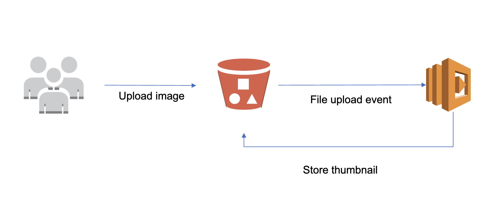

# local development

similar project: https://github.com/Haleshot/Object_Detection

# cloud deployment

product lookup: https://aws.amazon.com/console/

aws docs: https://docs.aws.amazon.com/

lab tutorial: https://awsacademy.instructure.com/courses/82630

aws lab session: https://awsacademy.instructure.com/courses/82630/modules/items/7490502

how to upload files into s3: https://docs.aws.amazon.com/AmazonS3/latest/userguide/upload-objects.html

# report

event driven architecture: https://aws.amazon.com/event-driven-architecture/
